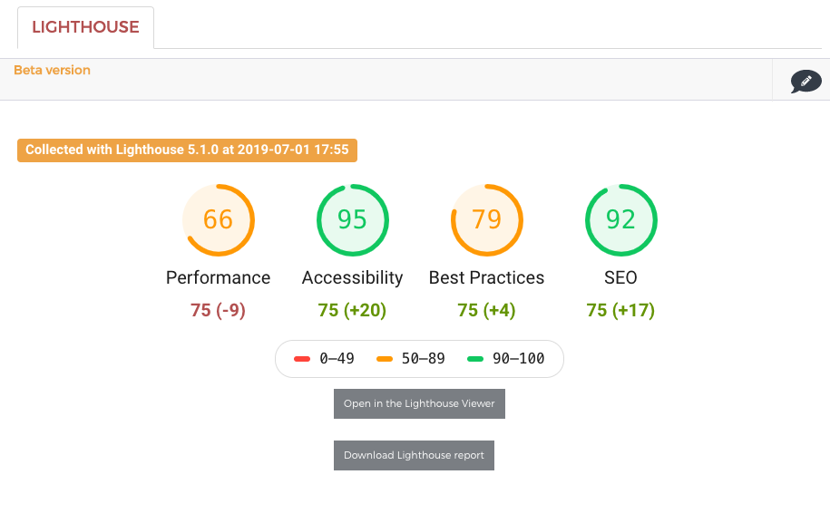

# AET Extension: Lighthouse
This repository contains the [Lighthouse]((https://developers.google.com/web/tools/lighthouse/)) 
extension for the [AET](https://github.com/Cognifide/aet).

Contents:
- bundle that contains Lighthouse Report [Collector](https://github.com/Cognifide/aet/wiki/Collectors) and
[Comparator](https://github.com/Cognifide/aet/wiki/Comparators),
- default configuration,
- [AET Report](https://github.com/Cognifide/aet/tree/master/report) extension for Lighthouse results,
- simple HTTP Server written in NodeJS that provides Web Endpoint to run Lighthouse



## Lighthouse Extension

### Lighthouse Collector
This collector requires external Lighthouse instance with Web Endpoint configured.
`lighthouseInstanceUri` property in the [`LighthouseCollectorFactory`](https://github.com/Skejven/aet-lighthouse-extension/blob/master/conf/com.github.skejven.collector.LighthouseCollectorFactory.cfg)
should be set to the Web Endpoint under which [Lighthouse Server](https://github.com/Skejven/aet-lighthouse-extension/tree/master/lighthouse-server)
works.
Expected response is a JSON with specification explained in the [Lighthouse Server Endpoint docs](https://github.com/Skejven/aet-lighthouse-extension/tree/master/lighthouse-server#endpoint).

Module name: **`lighthouse`**

#### Collector Parameters

No parameters so far.

### Lighthouse Comparator
This comparator is form of a health-check. It base on the Lighthouse report collected by the 
[AET Lighthouse Collector](#lighthouse-collector) and compares the results against KPI (see the 
[parameters](#comparator-parameters) section below).
If the difference between Lighthouse scores (from the collector) and any of `kpi-` parameter 
value is negative and bigger than `kpi-threshold`, comparison will end with `FAILED` status. E.g.
- Let's set `kpi-performance` to `80` and `kpi-threshold` to `10`.
  1. When the Lighthouse *Performance* audit score will be `60` that means that our KPI failed and the report will be red.
  2. When the Lighthouse *Performance* audit score will be `72` that means it fit in the threshold and it will pass.

Module name: **`lighthouse`**

Resource name: `lighthouse`

#### Comparator Parameters

| Parameter | Value | Description | Mandatory |
| --------- | ----- | ----------- | --------- |
| `kpi-threshold` | integer (default: `5`) | Accepted difference between `kpi` values and Lighthouse results | no |
| `kpi-performance` | integer (default: `75`) | Minimal score for `performance` KPI. | no |
| `kpi-accessibility` | integer (default: `75`) | Minimal score for `accessibility` KPI. | no |
| `kpi-best-practices` | integer (default: `75`) | Minimal score for `best-practices` KPI. | no |
| `kpi-seo` | integer (default: `75`) | Minimal score for `seo` KPI. | no |

### Example usage
To use the `lighthouse` plugin simply put `<lighthouse />` tag in `collect` and `compare` sections.

Example suite:

```xml
<?xml version="1.0" encoding="UTF-8" ?>
<suite name="lighthouse" company="aet" project="lighthouse">
    <test name="max-one-url">
        <collect>
            <lighthouse/>
        </collect>
        <compare>
            <lighthouse kpi-threshold="10"/>
        </compare>
        <urls>
            <url href="https://github.com"/>
        </urls>
    </test>
</suite>

```

> Yes, you don't need `<open/>`.

## Building
Simply run `build` task.
The results will be following artifacts:
- `aet-lighthouse-extension.jar` bundle
- `aet-lighthouse-extension-report.zip` - containing [AET Report](https://github.com/Cognifide/aet/tree/master/report) 
extension to display Lighthouse findings
- `aet-lighthouse-config.zip` - containing configs for the module
- `aet-lighthouse-server.zip` - containing simple HTTP Server written in NodeJS that runs Lighthouse

## Deploying
ToDo
